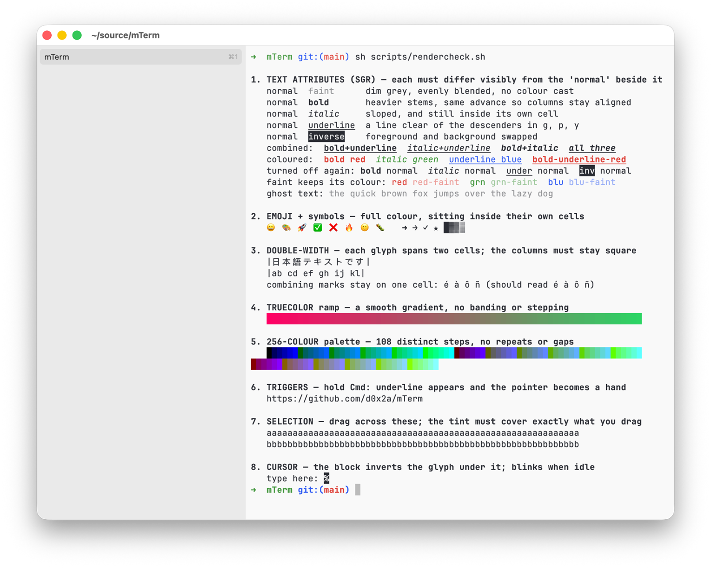
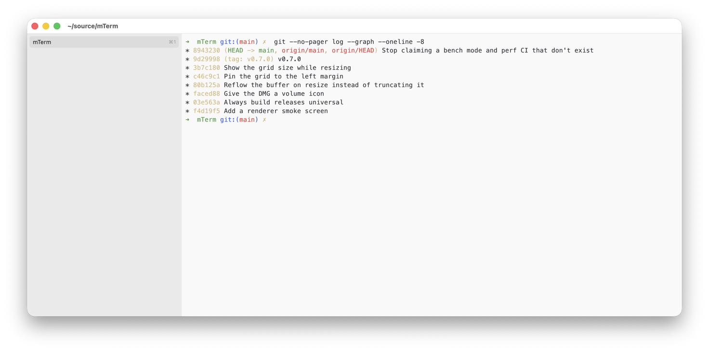

# mTerm

A native macOS terminal emulator. Opinionated, GPU-accelerated, focused.



<sub>`scripts/rendercheck.sh` — bold, italic, underline, faint and inverse, truecolor, the 256-colour palette, emoji, double-width CJK and combining marks, all in one screen.</sub>



> **Status:** v0.9.0 — pre-release. Daily-driveable for most workflows, but a few items from [SPEC.md](SPEC.md) are still in progress. Expect changes before 1.0.

## Why

mTerm is an alternative to iTerm2 for developers who want:

- A terminal that feels like a real Mac app, not a port.
- GPU-class rendering (Ghostty/Alacritty territory).
- A small, sharp feature set instead of a thousand preferences.

It is **not** trying to be Warp. No AI features, no command palettes that rethink the shell, no cloud accounts. Just a fast, beautiful, modern terminal.

## Install

### Homebrew (recommended)

```bash
brew install --cask d0x2a/tap/mterm
```

### Signed DMG

Grab the latest `.dmg` from [Releases](https://github.com/d0x2a/mTerm/releases), drag mTerm.app to `/Applications`. The DMG is a universal binary, signed with a Developer ID and notarized by Apple, so Gatekeeper will accept it on first launch.

### Build from source

Requires macOS 14+ and Xcode 15+ (or just the command-line tools with Swift 5.10+).

```bash
git clone https://github.com/d0x2a/mTerm.git
cd mTerm
swift run -c release mTerm
```

## What works today

- AppKit-native window with tabbed sidebar (drag to reorder), full-screen, session restore (tabs + CWDs). The sidebar and split divider tint to the active theme.
- Metal-rendered terminal view with pixel-snapped glyph atlas — crisp text at all sizes, no GPU filtering blur.
- Bold and italic draw in the font's own faces, not a synthesised slant or smear, and the advance is identical across all four so the columns never drift. Underline, faint and inverse too, including the codes that turn each of them back off.
- Resizing reflows the buffer: wrapped lines rejoin and re-split at the new width rather than being cut off, and the grid size shows in a readout while you drag.
- xterm-256color compatibility for vim/neovim/htop/fzf/less/git pagers. 24-bit true color, alt-screen, scroll regions (DECSTBM), DEC line drawing, and synchronized output (DEC 2026) so multi-line redraws land in one frame.
- Mouse reporting: SGR (1006) and legacy encodings for click, drag, motion, and wheel — hold ⇧ to select instead. Bracketed paste, focus events, and device/cursor-position reports.
- East Asian and fullwidth characters take their proper two columns, and combining marks compose into the glyph they follow, so CJK text stays in step with the shell's own cursor arithmetic.
- Scrollback search: plain text by default, regex via ⌥⌘F, smart-case.
- Shell integration for **zsh** via OSC 133: gutter prompt markers (color-coded by exit status), jump to previous/next prompt with ⌘↑ / ⌘↓.
- Themes: Tomorrow Night, Solarized (light + dark), Nord, Dracula, Gruvbox Dark, plus mTerm's own light + dark. Import any iTerm2 `.itermcolors` file. Auto light/dark switching follows the system appearance.
- macOS notifications for terminal attention events (bell, OSC 9 / OSC 777) — configurable in Settings.
- ⌘-click opens links: URLs (with or without a scheme — `code.d0x2a.com` and `localhost:3000/health` both count) go to the browser, file paths are revealed in Finder. Links aren't drawn differently from the text around them until you point at one: with ⌘ held, the link under the pointer takes the theme's accent colour with an underline to match, and the cursor becomes a hand, one link at a time rather than the whole screen at once. Only paths that exist on disk are offered, so `and/or` stays inert, a `file.swift:42` from compiler output links whole, and a URL that wraps across rows is treated as one address rather than two fragments.
- Close-confirmation when a foreground process is running (`vim`, `ssh`, etc.) — togglable in Settings.
- Font family, size, stroke weight, and line spacing (1.0×–2.0×, default 1.15×) are all adjustable live in Settings.
- Settings window organized into Appearance / General / Notifications panes.

## Not yet (tracked for v1)

- bash + fish shell integration (zsh only today).
- tmux `-CC` control mode.
- Profiles (named shell configurations).
- Triggers editor UI + `runCommand` action.
- Settings search.
- Configurable scrollback size from Settings.

## Keyboard shortcuts

| Action | Shortcut |
|---|---|
| New tab | ⌘T |
| Close tab | ⌘W |
| Next / previous tab | ⌘⇧] / ⌘⇧[  (also ⌘` / ⌘⇧`) |
| Jump to tab N | ⌘1 – ⌘9 (⌘9 = last) |
| Find in scrollback | ⌘F |
| Find (regex) | ⌥⌘F |
| Next / previous match | ⌘G / ⇧⌘G |
| Jump previous / next prompt | ⌘↑ / ⌘↓ |
| Toggle full screen | ⌃⌘F |
| Open Settings | ⌘, |

## Configuration

mTerm stores everything under `~/Library/Application Support/mTerm/`:

- `settings.json` — appearance mode, themes, font, close-warning preference.
- `state.json` — restored on next launch (tabs + window frame + full-screen state).

There's no config file in v1; everything is editable through the Settings window (⌘,).

## Architecture

See [SPEC.md](SPEC.md) for the full design — stack choices, terminal-emulation scope, performance budgets, and what's deliberately out of scope.

```
AppKit shell  →  MainWindowController + SidebarView
                    │
                    └─ N tabs, one Session each
                            │
                            ├─ PTY (forkpty + posix_spawn, off-main I/O)
                            ├─ VT parser  →  TerminalState
                            └─ Metal Renderer (glyph atlas, instanced cells)
```

## License

MIT — see [LICENSE](LICENSE). Copyright © 2026 Dox2A Labs LLC.
